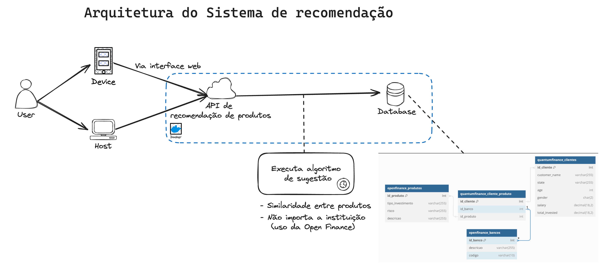

# Open Finance - QuantumFinance
Recommendations System with Open Finance

O Open Finance (“Sistema Financeiro Aberto”) é um conjunto de tecnologias e regras que pretendem dar maior controle e liberdade aos clientes de serviços financeiros.   
A Quantum Finance utilizará esses dados em seu algoritmo de recomendação de produtos. Para trazer sugestões mais relevantes para seus clientes.